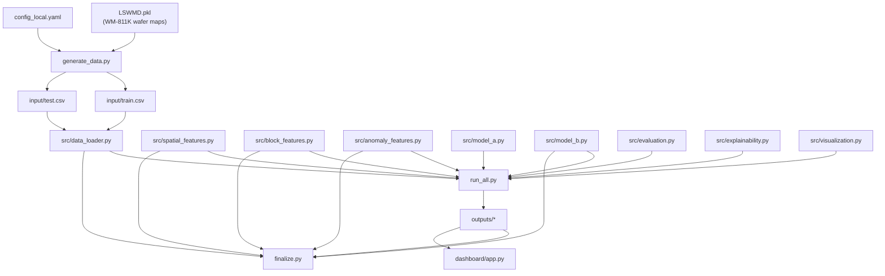

# SanDisk Hackathon — Complete Project Walkthrough & Team Knowledge Guide

> **Purpose**: This document teaches every team member how our project actually works — from raw data to final predictions. Read this carefully before the Bangalore final. Every fact in this document was verified against the actual codebase, not assumed from a README.

---

## Table of Contents

| # | Chapter | What You'll Learn |
|---|---------|-------------------|
| 1 | [What Are We Actually Building?](#chapter-1) | The simplest possible explanation |
| 2 | [The Problem Statement](#chapter-2) | Wafers, dies, labels, and what we predict |
| 3 | [Project at a Glance](#chapter-3) | The full pipeline in one diagram |
| 4 | [Complete Data Flow](#chapter-4) | Follow one die through everything |
| 5 | [Dataset](#chapter-5) | What our data actually looks like |
| 6 | [Data Generation](#chapter-6) | How we create synthetic data (and why) |
| 7 | [Feature Engineering](#chapter-7) | All the features, grouped and explained |
| 8 | [Spatial Information](#chapter-8) | How neighborhood context works |
| 9 | [Block-Level Data](#chapter-9) | The 2,000 sub-die readings |
| 10 | [Model A](#chapter-10) | Die + Spatial + Anomaly |
| 11 | [Model B](#chapter-11) | Everything in Model A + Block features |
| 12 | [Why Model A vs Model B?](#chapter-12) | The scientific question |
| 13 | [Training Pipeline](#chapter-13) | Exactly what happens during training |
| 14 | [Data Splitting & Leakage](#chapter-14) | How we prevent cheating |
| 15 | [Class Imbalance](#chapter-15) | Why accuracy is misleading |
| 16 | [Model Results](#chapter-16) | The actual numbers |
| 17 | [Interpretability](#chapter-17) | SHAP, counterfactuals, failure signatures |
| 18 | [Visualizations](#chapter-18) | Every plot explained |
| 19 | [File-by-File Map](#chapter-19) | What each file does |
| 20 | [If I Run the Project, What Happens?](#chapter-20) | Step-by-step execution |
| 21 | [How Components Connect](#chapter-21) | Dependency diagram |
| 22 | [Judge Preparation](#chapter-22) | 20 likely questions with answers |
| 23 | [Do NOT Say This to the Judges](#chapter-23) | Honest limitations |
| 24 | [2-Day Crash Course](#chapter-24) | Must Know / Should Know / Nice to Know |
| 25 | [5-Minute Explanation](#chapter-25) | Explain the project to a teammate |
| 26 | [30-Second Elevator Pitch](#chapter-26) | One-paragraph summary |
| 27 | [Final Mental Model](#chapter-27) | If you remember only one thing |

---

<a id="chapter-1"></a>
## Chapter 1 — What Are We Actually Building? 

Imagine a silicon wafer coming off a semiconductor fabrication line. A wafer is a circular disc about the size of a dinner plate, and it's covered with a grid of tiny chips called **dies**. Each die will eventually become a chip inside a flash drive, SSD, or phone.

Before the wafer is cut up and the dies are packaged, the factory runs a quick electrical test on every die. Some dies obviously fail this test — they're already broken. Those are marked as **pre-test failures** (we call them `old_label = 1`).

But here's the problem: **some dies pass the pre-test but later fail** during a harder, more expensive stress test called burn-in. These are **latent defects** — the die looks fine on the surface but has a hidden weakness. If the factory packages these dies and ships them, they'll fail in customers' hands.

**Our project predicts which currently-passing dies will fail later.**

Think of it like this: the pre-test is a quick doctor's checkup, and burn-in is a full MRI. We're trying to figure out who needs the MRI *before* spending the money on it.

### What we use to make predictions

We feed three types of information into our models:

1. **Die-level measurements** — 500 electrical/parametric readings from each die (like blood pressure, heart rate, cholesterol)
2. **Spatial context** — where the die sits on the wafer and what's happening to its neighbors (are nearby dies failing?)
3. **Block-level readings** — 2,000 fine-grained sub-die measurements (like zooming into different organs)

### The two-model comparison

We built two models:

- **Model A**: Uses die measurements + spatial context + an anomaly score
- **Model B**: Uses everything Model A uses + block-level sub-die readings

The core scientific question is: **Does the extra block-level detail actually help predict failures better?**

> **Spoiler**: Block data significantly improves continuous probability *ranking* (PR-AUC) but barely moves the binary pass/fail decision (F1). We'll explain why later.

---

<a id="chapter-2"></a>
## Chapter 2 — The Problem Statement

### 2.1 What is a wafer?

A wafer is a thin circular disc of silicon, typically 200mm or 300mm in diameter. During manufacturing, hundreds or thousands of identical circuits (dies) are fabricated on a single wafer simultaneously. You can think of a wafer as a grid of tiny chips, where each cell in the grid is one die.

### 2.2 What is a die?

A die is a single chip on the wafer. It's the smallest independent unit. After testing, the wafer is cut along grid lines and each die is individually packaged to become a finished product. In our project, each die has a specific position identified by `die_row` and `die_col`.

### 2.3 What is die yield?

Yield is the fraction of dies on a wafer that work correctly. A wafer with 1,000 dies where 950 pass has a 95% yield. Higher yield = more revenue per wafer = better.

### 2.4 What does pass/fail mean?

- **Pass (label = 0)**: The die works correctly and can be packaged and sold
- **Fail (label = 1)**: The die is defective and must be discarded

### 2.5 What is pre-test (old_label)?

The pre-test is an initial, relatively quick electrical test run on every die while it's still on the wafer. Dies that obviously fail this test are marked `old_label = 1`. These are "known bad" — we already know they're broken.

### 2.6 What is post-test (label)?

The post-test (label) represents the final status after burn-in or stress testing. Dies that were already failed stay failed. But some dies that *passed* the pre-test now fail the post-test — these are the **new failures** we want to predict.

### 2.7 What is old_label?

`old_label` is the **pre-test result**. It's a feature we can use for prediction because it's known before the post-test happens.

| old_label | Meaning |
|-----------|---------|
| 0 | Die passed pre-test (currently looks good) |
| 1 | Die failed pre-test (already known bad) |

### 2.8 What is label?

`label` is the **post-test result** — this is our **prediction target**. We're trying to predict this value for `old_label = 0` dies.

| label | Meaning |
|-------|---------|
| 0 | Die passed both pre-test and post-test (truly good) |
| 1 | Die failed the post-test (includes old fails + new fails) |

### 2.9 What exactly are we predicting?

We are predicting: **Among the dies that passed pre-test (`old_label = 0`), which ones will fail post-test (`label = 1`)?**

We evaluate ONLY on `old_label = 0` dies because:
- `old_label = 1` dies are trivially predicted as fail (they already failed)
- Including them would artificially inflate our accuracy

### 2.10 Why is the problem difficult?

1. **Class imbalance**: Only ~2-4% of eligible dies fail. A model that always predicts "pass" gets 96%+ accuracy while being completely useless.
2. **Marginal failures**: 65% of failing dies in our dataset are "marginal" — their electrical signatures overlap heavily with passing dies. They're almost indistinguishable.
3. **Sparse sub-die signal**: In failing dies, only ~5% of the 2,000 block readings actually show anomalous behavior. The defect signal is buried in noise.
4. **Multi-scale information**: Useful signals exist at die-level, neighborhood-level, and sub-die-level — the model needs to fuse all of these.

### 2.11 Why is class imbalance important?

If 97% of dies pass, a dummy model that always predicts "pass" has 97% accuracy. That model catches **zero** failures. We need metrics that account for this — specifically **Fail F1** and **PR-AUC** (Precision-Recall Area Under Curve).

### 2.12 Why does spatial context matter?

Defects on semiconductor wafers are not randomly distributed. They cluster spatially — a scratch across the wafer, contamination in one region, edge effects from process chemistry. If your neighbors are failing, you're more likely to fail too.

### 2.13 Why do block-level readings matter?

A die is not a single homogeneous unit. It contains many internal structures (memory blocks, logic circuits). A defect might affect only a small region of the die. The 2,000 block readings let us look *inside* the die for localized anomalies that the die-level average measurements might miss.

### 2.14 Why is interpretability required?

Semiconductor engineers won't trust a black-box model. They need to know *why* a die is flagged — is it because of spatial proximity to failures? Abnormal electrical readings? Block-level anomalies? Our SHAP-based explanation layer provides this.

### 2.15 Known Before Prediction vs. Target

| **KNOWN BEFORE PREDICTION** | **TARGET (FUTURE)** |
|-----------------------------|---------------------|
| `wafer_id`, `die_row`, `die_col` | `label` (post-test result) |
| `feature_1` through `feature_500` | |
| `old_label` (pre-test result) | |
| `block_readings` (2,000 sub-die values) | |
| Derived spatial features (from old_label) | |
| Derived block statistics | |
| Anomaly scores | |

---

<a id="chapter-3"></a>
## Chapter 3 — Project at a Glance

Here is the actual pipeline as implemented in our code:

```
┌───────────────────────────────────────────────────────────┐
│  WM-811K Wafer Maps (LSWMD.pkl)                          │
│  Real wafer failure patterns from Kaggle                  │
└───────────────┬───────────────────────────────────────────┘
                │
                ▼
┌───────────────────────────────────────────────────────────┐
│  generate_data.py                                         │
│  Generates synthetic die features + block readings        │
│  on top of real wafer geometry                            │
│  Output: input/train.csv, input/test.csv                  │
└───────────────┬───────────────────────────────────────────┘
                │
                ▼
┌───────────────────────────────────────────────────────────┐
│  src/data_loader.py                                       │
│  Loads CSVs, parses block readings                        │
│  Wafer-level train/val split (80/20)                      │
└───────────────┬───────────────────────────────────────────┘
                │
        ┌───────┼───────────┐
        ▼       ▼           ▼
┌──────────┐ ┌──────────┐ ┌──────────────────┐
│ Spatial  │ │  Block   │ │  Anomaly         │
│ Features │ │ Features │ │  Detectors       │
│ (10 cols)│ │ (19 cols)│ │  (2 scores)      │
│ spatial_ │ │ block_   │ │  DieAnomalyDet.  │
│features. │ │features. │ │  BlockAnomalyDet.│
│py        │ │py        │ │  anomaly_features│
└────┬─────┘ └────┬─────┘ └────────┬─────────┘
     │            │                │
     └────────┬───┘────────────────┘
              │
     ┌────────┴────────┐
     ▼                 ▼
┌──────────┐    ┌──────────┐
│ MODEL A  │    │ MODEL B  │
│ 500 feat │    │ 500 feat │
│ +10 sp   │    │ +10 sp   │
│ +1 anom  │    │ +1 anom  │
│ = 511    │    │ +19 blk  │
│ features │    │ +1 blk_  │
│          │    │   anom   │
│ LightGBM │    │ = 531    │
│          │    │ features │
│          │    │ LightGBM │
└────┬─────┘    └────┬─────┘
     │               │
     ▼               ▼
┌──────────────────────────┐
│ src/evaluation.py        │
│ Threshold selection      │
│ Confusion matrix         │
│ PR-AUC, F1, Precision,   │
│ Recall                   │
└────────────┬─────────────┘
             │
             ▼
┌──────────────────────────┐
│ Interpretability Layer   │
│ - TreeSHAP attribution   │
│ - HDBSCAN failure        │
│   signature clustering   │
│ - Model-based            │
│   counterfactuals        │
│ - Continuous 2D Gaussian │
│   wafer risk fields      │
│ - Bootstrap uncertainty  │
└────────────┬─────────────┘
             │
             ▼
┌──────────────────────────┐
│ Outputs                  │
│ - predictions.csv        │
│ - comparison tables      │
│ - SHAP plots             │
│ - wafer heatmaps         │
│ - results_summary.md     │
│ - Streamlit dashboard    │
└──────────────────────────┘
```

### What each box does (2–5 sentences)

| Stage | What | Why | Input | Output |
|-------|------|-----|-------|--------|
| **WM-811K** | Public dataset of real wafer maps with labeled failure patterns | Gives us realistic wafer geometry and spatial failure patterns | Kaggle download (LSWMD.pkl, ~2GB) | 2D numpy arrays per wafer (0=no die, 1=pass, 2=fail) |
| **generate_data.py** | Creates synthetic parametric features and block readings on top of the wafer maps | We don't have real semiconductor production data, so we simulate it with realistic statistical properties | WM-811K wafer maps + config.yaml | train.csv (~3.8GB), test.csv (~880MB) |
| **data_loader.py** | Reads CSVs, provides wafer-level splitting | Clean data loading with alignment assertions and split-disjointness checks | CSV files from input/ | DataFrames for train, validation, test |
| **Spatial Features** | Computes 10 features from die position and old_label | Captures wafer-level spatial patterns (edge effects, defect clustering, proximity to known failures) | wafer_id, die_row, die_col, old_label | 10-column DataFrame (sp_radial, sp_dist_to_fail, etc.) |
| **Block Features** | Extracts 19 statistical summaries from 2,000 raw block readings | Distills high-dimensional sub-die signal into manageable features (mean, std, anomaly counts, etc.) | 2,000 raw block reading values per die | 19-column DataFrame (blk_mean, blk_std, etc.) |
| **Anomaly Detectors** | Two Isolation Forest models trained on healthy dies only | Flags dies whose parametric or block patterns look "unusual" compared to known-good population | Parametric features (die-level) and block stats | Two scalar scores per die |
| **Model A** | LightGBM classifier on 511 features | Baseline model using die measurements + spatial context | 500 parametric + 10 spatial + 1 die anomaly score | Failure probability per die |
| **Model B** | LightGBM classifier on 531 features | Extended model that adds sub-die block information | All of Model A + 19 block stats + 1 block anomaly score | Failure probability per die |
| **Evaluation** | Computes metrics on eligible (old_label=0) dies only | Fair evaluation excluding trivial old fails | Predictions + ground truth | F1, PR-AUC, precision, recall, confusion matrix |
| **Interpretability** | SHAP explanations, failure clustering, counterfactuals, wafer risk fields | Makes predictions trustworthy and actionable for engineers | Model + feature matrices + predictions | SHAP plots, per-die explanations, risk field figures |

---

<a id="chapter-4"></a>
## Chapter 4 — Complete Data Flow (Follow One Die)

Let's trace a **fictional example die** through the entire pipeline. (Values below are illustrative — the process is accurate.)

### Stage 1: Raw Wafer Map

The WM-811K dataset provides a 2D numpy array for wafer `W_F_0014`:

```
Wafer map shape: (52, 62)
Values: 0 = no die position, 1 = pass, 2 = fail
Our die at row=40, col=18 has value 1 (passed pre-test)
```

### Stage 2: Feature Generation (`generate_data.py`)

For this die, the generator:
1. Creates 500 parametric features by sampling from a normal distribution centered on each feature's `base_mean` with std = `base_std`
2. Adds spatial gradients (radial + linear) to simulate process chamber effects
3. Adds neighborhood influence (nearby failures shift feature values slightly)
4. Since this die's `label = 1` (will fail post-test), a small `fail_shift` is applied to all 500 features. But if this die is "marginal" (65% chance), the shift is only 5-25% of the full shift — making it nearly invisible
5. Generates 2,000 block readings from N(100, 15). Since this die fails, ~5% of blocks (≈100 blocks) get a small anomalous shift of ~4.5 units, clustered around a random seed position

**Output for this die**: One row in `train.csv` or `test.csv`:
```
wafer_id: W_F_0014
die_row: 40
die_col: 18
feature_1: 247.31
feature_2: -1.89
... (498 more features)
block_readings: "99.23 101.45 98.77 ... 104.67 103.21" (2,000 space-separated values)
old_label: 0  (passed pre-test)
label: 1      (will fail post-test — this is our target)
```

### Stage 3: Spatial Feature Computation (`src/spatial_features.py`)

For this die, we compute 10 spatial features using **only** `old_label`, `die_row`, `die_col`, and `wafer_id`:

| Feature | Value (example) | Meaning |
|---------|--------|---------|
| `sp_row_norm` | 0.78 | Normalized row position (0 to 1) |
| `sp_col_norm` | 0.29 | Normalized col position |
| `sp_radial` | 0.65 | Normalized distance from wafer center (0=center, 1=edge) |
| `sp_edge_prox` | 0.35 | How close to the wafer edge |
| `sp_old_fail_density_3` | 0.33 | Fraction of pre-test failures in 3×3 neighborhood |
| `sp_old_fail_density_5` | 0.20 | Same for 5×5 window |
| `sp_old_fail_density_7` | 0.14 | Same for 7×7 window |
| `sp_zone_yield` | 0.87 | Pre-test yield in this die's wafer zone (4×4 grid) |
| `sp_dist_to_fail` | 0.03 | Normalized Euclidean distance to nearest old_label=1 die |
| `sp_old_label` | 0 | The old_label itself (pre-test status) |

> **Critical**: These features NEVER use `label`. A unit test (`test_no_leakage`) verifies this.

### Stage 4: Block Feature Extraction (`src/block_features.py`)

The 2,000 raw block readings are parsed from the space-separated string and transformed into 19 summary statistics:

| Feature | Value (example) | What it captures |
|---------|--------|------------------|
| `blk_mean` | 100.8 | Average block reading (slightly elevated if failing) |
| `blk_std` | 15.2 | Spread of readings |
| `blk_median` | 100.3 | Robust center |
| `blk_iqr` | 20.1 | Interquartile range |
| `blk_skew` | 0.12 | Distribution asymmetry |
| `blk_kurt` | 0.05 | Heavy-tailedness |
| `blk_min` / `blk_max` | 52.3 / 152.1 | Extremes |
| `blk_n_anom_fixed` | 3 | Blocks outside [55, 145] (3σ from base) |
| `blk_frac_anom_fixed` | 0.0015 | Fraction of anomalous blocks (fixed threshold) |
| `blk_n_anom_mad` | 97 | Blocks >2×MAD from median (tighter, adaptive threshold) |
| `blk_frac_anom_mad` | 0.0485 | Fraction anomalous (MAD-based) |
| `blk_max_deviation` | 52.1 | Max deviation from base mean (100.0) |
| `blk_longest_run` | 4 | Longest consecutive anomalous block streak |
| `blk_n_clusters` | 2 | Number of separate anomalous clusters |
| `blk_mad` | 10.3 | Median Absolute Deviation |
| `blk_range` | 99.8 | Max − Min |
| `blk_q25` / `blk_q75` | 90.1 / 110.2 | 25th and 75th percentiles |

### Stage 5: Anomaly Scoring (`src/anomaly_features.py`)

Two separate Isolation Forest models score this die:

1. **Die Anomaly Score**: Trained on all 500 parametric features of `old_label=0` training dies. This die gets score = 0.52 (higher = more anomalous).
2. **Block Anomaly Score**: Trained on the 19 block statistics of `old_label=0` training dies. This die gets score = 0.48.

### Stage 6: Model Input Assembly

**Model A** (`src/model_a.py → get_feature_set_a`):
```
feature_1, feature_2, ..., feature_500    (500 parametric features)
sp_row_norm, sp_col_norm, ..., sp_old_label  (10 spatial features)
die_anomaly_score                          (1 anomaly score)
────────────────────────────────────────────
Total: 511 features
```

**Model B** (`src/model_b.py → get_feature_set_b`):
```
[All 511 Model A features]
blk_mean, blk_std, ..., blk_q75           (19 block features)
blk_anomaly_score                          (1 block anomaly score)
────────────────────────────────────────────
Total: 531 features
```

### Stage 7: Prediction

The LightGBM model outputs a probability. For this example die:
- Model A probability: 0.905 (90.5%)
- Model B probability: 0.905 (90.5%)

### Stage 8: Threshold Application

Model B's tuned threshold is **0.5180**. Since 0.905 ≥ 0.518 → `predicted_label = 1` (fail).

### Stage 9: SHAP Explanation

TreeSHAP reveals the top contributors:
1. `sp_dist_to_fail` (SHAP −1.0208) — very close to a known failure
2. `blk_mean` (SHAP +0.7047) — block readings slightly elevated
3. `blk_q75` (SHAP +0.3758) — upper quartile of blocks is high

The die is classified into **Cluster 2: "Defect Neighborhood Proximity & Spatial Clustering"**.

### Stage 10: Visualization

The dashboard shows this die on:
- A 4-panel wafer map (pre-test, ground truth, prediction, probability heatmap)
- A continuous 2D Gaussian risk field with hotspot contours
- A block strip plot with anomalous readings highlighted in red

---

<a id="chapter-5"></a>
## Chapter 5 — Dataset

### 5.1 Source

The foundational geometry comes from the **WM-811K** dataset (Kaggle), which contains real wafer maps from semiconductor manufacturing. The parametric features and block readings are **synthetically generated** on top of these real wafer maps.

### 5.2 Dataset size

| Split | Wafers | Total Dies | File Size |
|-------|--------|-----------|-----------|
| Train | 160 | ~155,000+ | ~3.8 GB |
| Test | 40 | 39,351 | ~880 MB |
| Validation | 40 | (same as test, labels dropped) | ~880 MB |

> **Note**: The validation CSV (`validation.csv`) is just the test set with the `label` column removed. The actual *model validation* uses a 20% wafer-level hold-out from training data.

### 5.3 Train/Validation split

The training data is further split into:
- **80% training** (~128 wafers) — used to fit models
- **20% validation** (~32 wafers) — used for threshold tuning and early stopping

Split is **wafer-level** (all dies from a wafer go to the same split). Stratified by whether the wafer has any new failures.

### 5.4 Column structure

| Column | Type | Count | Description |
|--------|------|-------|-------------|
| `wafer_id` | string | 1 | e.g. "W_F_0014" or "W_N_0108" |
| `die_row` | int | 1 | Row position on wafer grid |
| `die_col` | int | 1 | Column position on wafer grid |
| `feature_1` to `feature_500` | float | 500 | Synthetic parametric measurements |
| `block_readings` | string | 1 | 2,000 space-separated float values |
| `old_label` | int (0/1) | 1 | Pre-test result |
| `label` | int (0/1) | 1 | Post-test result (TARGET) |

**Total columns**: 505 (3 ID + 500 features + block_readings + old_label + label)

### 5.5 Target distribution (approximate)

| | Count | Percentage |
|---|-------|-----------|
| Total dies (test set) | 39,351 | 100% |
| old_label = 1 (pre-test fails) | ~6,753 | ~17.2% |
| old_label = 0 (eligible) | ~32,598 | ~82.8% |
| Among eligible: label = 1 (new fails) | ~1,380 | ~4.2% of eligible |
| Among eligible: label = 0 (still pass) | ~31,218 | ~95.8% of eligible |

### 5.6 Wafer ID naming convention

- `W_F_XXXX` — Wafer selected from WM-811K's "failure-pattern" subset (has known defect patterns like edge rings, scratches, center defects)
- `W_N_XXXX` — Wafer selected from WM-811K's "none" subset (all-pass pre-test wafers)

---

<a id="chapter-6"></a>
## Chapter 6 — Data Generation (Synthetic Data)

> **This is critical for judge preparation. The data is NOT real semiconductor production data.**

### 6.1 Where the wafer maps come from

The wafer map geometry and pre-test labels (`old_label`) come from the **WM-811K dataset** on Kaggle. This is a real, public dataset from a semiconductor fab containing ~811,457 wafer maps. Each map is a 2D numpy array where:
- `0` = no die at this position (wafer edge)
- `1` = die passed pre-test
- `2` = die failed pre-test

These wafer maps have **real spatial failure patterns** (edge rings, center blobs, scratches, random defects).

### 6.2 How wafers are selected (`select_wafers`)

- The generator mixes "failure-pattern" wafers (which have pre-test failures) with "none" wafers (all-pass) to achieve a target overall fail rate of ~3%
- About 25% of selected wafers have failure patterns; 75% are all-pass
- Selection is random with seed=42 for reproducibility

### 6.3 How die-level features are generated

For each of the 500 features, the generator:

1. Samples a `base_mean` from log-uniform([0.1, 5000]) — so features span many orders of magnitude
2. Samples a coefficient of variation (CV) from uniform([0.02, 0.15])
3. Computes `base_std = |base_mean| × CV`
4. Samples a `fail_shift` as a fraction of `base_std` (between 0.1× and 0.5×, randomly positive or negative)
5. 20% of features have negative means (simulating threshold voltages)

For each die on the wafer:
- **All dies** get a base sample: `N(base_mean, base_std)`
- **Spatial gradients** are added: radial distance from center (strength 0.3) and a random linear gradient (strength 0.15), simulating process chamber non-uniformity
- **Neighborhood influence**: dies near existing failures get a slight feature shift (0.2 × fail_shift × local_fail_density)
- **Failing dies** (`label = 1`) get an additional `fail_shift` added to their features

### 6.4 How marginal failures work

This is the key to why the problem is hard:
- 65% of all failing dies are marked as **marginal**
- Marginal fails get only **5–25% of the full fail_shift** (chosen randomly per die)
- This makes them nearly indistinguishable from passing dies in feature space
- Only 35% of failures have "clear" signatures

### 6.5 How new post-test failures are generated

1. Each wafer gets a random base fail rate drawn from Exponential(mean=0.02), capped at 0.25
2. For each passing die, the probability of newly failing is: `base_rate + 3 × base_rate × local_fail_density + 1.5 × base_rate × radial_distance`
3. Dies near existing failures and at wafer edges have higher new-failure probability
4. The new failures are sampled probabilistically

### 6.6 How block readings are generated

For each die, 2,000 block readings are generated:

- **Base**: `N(100, 15)` for every block
- **Spatial correlation**: A smoothing filter (kernel size 5) creates correlation between neighboring blocks (60% raw + 40% smoothed)
- **Failing dies**: ~5% of blocks (~100 blocks) get an anomalous shift of `N(4.5, 1.35)` added. These blocks are **spatially clustered** around a random seed position

### 6.7 Why does this matter for judges?

**Honest answer for judges**:

> "Our data is **semi-synthetic**. The wafer maps — the geometry, die positions, and spatial failure patterns — come from the WM-811K public dataset, which contains real wafer maps from a semiconductor fab. On top of these real spatial patterns, we generated synthetic parametric features and block readings with controlled statistical properties. This allowed us to create a precisely-controlled experimental setup where we know the ground truth and can rigorously evaluate the contribution of each signal type. In a production deployment, these features would come from actual electrical test equipment."

### 6.8 Limitations of synthetic data

- The feature distributions are Gaussian with known shifts — real features may have more complex distributions
- The relationship between features and failure is injected by design — real correlations could be nonlinear and more subtle
- Block anomalies are spatially clustered in a simple pattern — real sub-die defects could have more complex spatial signatures
- The 65% marginal failure fraction is a design parameter — the real fraction is unknown

---

<a id="chapter-7"></a>
## Chapter 7 — Feature Engineering

### Group A: Die-Level Parametric Features (500 features)

**What they represent**: Electrical and parametric test measurements from each die — think of these as 500 different "vital signs" for a chip (voltages, currents, timing measurements, resistance values, etc.).

**How they are calculated**: Sampled from `N(base_mean, base_std)` during data generation with spatial gradients added. No further transformation is applied during training — they are used **as-is** from the CSV.

**Where used**: Both Model A and Model B.

**Why they might help**: Failing dies have slightly shifted distributions (due to `fail_shift`), so the ensemble of 500 features, even with weak individual signal, provides discriminative power through the "many weak learners" effect.

### Group B: Spatial Features (10 features)

Computed in [spatial_features.py](file:///c:/Users/Aditya%20Gupta/OneDrive/Desktop/sandisk/src/spatial_features.py) using ONLY `old_label`, `die_row`, `die_col`, `wafer_id`.

| Feature | What it represents | Why it helps |
|---------|-------------------|--------------|
| `sp_row_norm` | Normalized row position (0–1) | Captures systematic row-dependent effects |
| `sp_col_norm` | Normalized column position (0–1) | Captures column-dependent effects |
| `sp_radial` | Distance from wafer center (0=center, 1=edge) | Edge dies fail more often (verified in EDA) |
| `sp_edge_prox` | How close to wafer edge (1=on edge, 0=center) | Alternative edge effect signal |
| `sp_old_fail_density_3` | Old-fail fraction in 3×3 window | Fine-grained local failure clustering |
| `sp_old_fail_density_5` | Old-fail fraction in 5×5 window | Medium-range failure clustering |
| `sp_old_fail_density_7` | Old-fail fraction in 7×7 window | Broader failure clustering |
| `sp_zone_yield` | Old-label yield in the die's 4×4 zone | Zone-level quality variation |
| `sp_dist_to_fail` | Normalized distance to nearest old-fail die | **Strongest single spatial predictor** — the closer you are to an existing failure, the more likely you are to fail |
| `sp_old_label` | The pre-test status itself (0 or 1) | Directly indicates known failure status |

> **Key insight from results**: `sp_dist_to_fail` is the **#1 most important feature in the entire model** (SHAP = 1.167), far ahead of any individual parametric feature.

### Group C: Block-Level Features (19 features)

Computed in [block_features.py](file:///c:/Users/Aditya%20Gupta/OneDrive/Desktop/sandisk/src/block_features.py) from the 2,000 raw block readings.

These are statistical summaries — the raw 2,000 values are **NOT** fed directly to the model.

| Feature | What it captures |
|---------|-----------------|
| `blk_mean` | Overall average — shifted in failing dies (**#2 most important feature overall**, SHAP = 0.381) |
| `blk_std` | Spread — anomalous blocks increase variance |
| `blk_median` | Robust center (less sensitive to outliers) |
| `blk_iqr` | Interquartile range — measures core spread |
| `blk_skew` | Distribution asymmetry — anomalous blocks create skew |
| `blk_kurt` | Heavy-tailedness — anomalous blocks create fat tails |
| `blk_min` / `blk_max` | Extreme values |
| `blk_n_anom_fixed` / `blk_frac_anom_fixed` | Count/fraction of blocks outside [55, 145] (fixed threshold) |
| `blk_n_anom_mad` / `blk_frac_anom_mad` | Count/fraction of blocks >2×MAD from median (adaptive threshold) |
| `blk_max_deviation` | Max |reading − 100.0| |
| `blk_longest_run` | Longest consecutive anomalous streak |
| `blk_n_clusters` | Number of separate anomalous clusters |
| `blk_mad` | Median Absolute Deviation |
| `blk_range` | Max − Min |
| `blk_q25` / `blk_q75` | Quartile values |

### Group D: Anomaly Scores (2 features)

Computed in [anomaly_features.py](file:///c:/Users/Aditya%20Gupta/OneDrive/Desktop/sandisk/src/anomaly_features.py) using Isolation Forest.

| Feature | Trained on | Used by |
|---------|-----------|---------|
| `die_anomaly_score` | 500 parametric features of `old_label=0` training dies | Model A and Model B |
| `blk_anomaly_score` | 19 block statistics of `old_label=0` training dies | Model B only |

**How Isolation Forest works (simple version)**: It builds random trees that try to isolate each data point. Points that are easy to isolate (unusual) get shorter paths → higher anomaly scores. We train only on "healthy" (old_label=0) dies, so anything that looks different from normal gets a high score.

**We negate the score** so that higher = more anomalous (Isolation Forest's native `score_samples()` returns higher values for normal points).

---

<a id="chapter-8"></a>
## Chapter 8 — Spatial Information

### How spatial information is handled

1. **Die coordinates are used**: `die_row` and `die_col` are normalized (0–1) and used directly as features
2. **Neighborhoods are used**: At three window sizes — 3×3, 5×5, and 7×7
3. **Failure density is calculated**: Using scipy's `uniform_filter` as a fast local average of the old_label=1 mask
4. **Radial distance is used**: Euclidean distance from wafer center, normalized by max possible distance
5. **Wafer zones are used**: 4×4 grid zones, with zone-level pre-test yield computed for each
6. **Distance to nearest old-fail die is computed**: Using scipy's KDTree for efficient nearest-neighbor search
7. **Spatial information is transformed into features**: All spatial signals become tabular features consumed by LightGBM. There is no graph neural network or convolutional approach — just engineered features

### The intuition

> "Why should the dies around this die tell us anything about its failure risk?"

Semiconductor defects are physical phenomena. A particle contamination, a scratch from handling, or uneven chemical etching don't affect just one die — they create a *region* of degraded dies. If you see several pre-test failures clustered in one area, the dies nearby (even the ones that passed pre-test) likely experienced the same physical stress. Their features might be "on the edge" — passed the initial threshold but weakened enough to fail under burn-in stress.

Our data generation explicitly encodes this: new-failure probability is boosted by `3 × base_rate × local_fail_density`. And the radial term (`1.5 × base_rate × radial_distance`) captures the real-world phenomenon that wafer edges experience more thermal stress, chemical non-uniformity, and mechanical stress.

### Which model uses spatial info?

**Both** Model A and Model B use all 10 spatial features. The spatial features are computed identically for both models.

---

<a id="chapter-9"></a>
## Chapter 9 — Block-Level Data

### What are the 2,000 block readings?

In a real semiconductor context, a NAND flash die contains millions of memory cells organized into blocks. Each block can be individually tested. Our 2,000 block readings simulate measurements from 2,000 sub-regions within a single die.

For most dies (passing dies), all 2,000 blocks show normal readings centered around 100.0 with std ~15.

For failing dies, a small fraction (~5%, i.e., ~100 blocks) show slightly anomalous readings shifted by ~4.5 units. These anomalous blocks are **spatially clustered** within the die (not randomly distributed).

### How are the readings stored?

As a single space-separated string in the `block_readings` column:
```
"99.23 101.45 98.77 ... 104.67 103.21"
```

### How are they parsed?

`numpy.fromstring(val, dtype=np.float32, sep=" ")` converts the string to a float array.

### How are they transformed?

The raw 2,000 values are **NOT** fed to the model directly. Instead, 19 summary statistics are extracted (mean, std, median, IQR, skew, kurtosis, min, max, anomaly counts, cluster counts, etc.).

### Why not use all 2,000 values directly?

1. LightGBM can't effectively handle 2,000 positionally-indexed values without special treatment
2. The anomaly signal is sparse (5% of blocks) — raw values would be mostly noise
3. Summary statistics capture the signal efficiently
4. Memory: 2,000 values × 155,000 dies = 310M values in training alone

### Which model uses block info?

**Only Model B**. Model A deliberately excludes all block features to serve as the comparison baseline.

### The transformation pipeline

```
2,000 raw float values (space-separated string)
        │
        ▼  (numpy.fromstring)
2,000-element float32 array
        │
        ▼  (_extract_one in block_features.py)
19 summary statistics:
  - blk_mean, blk_std, blk_median, blk_iqr
  - blk_skew, blk_kurt, blk_min, blk_max
  - blk_n_anom_fixed, blk_frac_anom_fixed
  - blk_n_anom_mad, blk_frac_anom_mad
  - blk_max_deviation, blk_longest_run
  - blk_n_clusters, blk_mad, blk_range
  - blk_q25, blk_q75
        │
        ▼  (also fed to BlockAnomalyDetector)
1 block anomaly score
        │
        ▼
Total: 20 block-related features → Model B
```

> **No PCA is used**. No autoencoder. No dimensionality reduction beyond the 19 handcrafted statistics.

---

<a id="chapter-10"></a>
## Chapter 10 — Model A

### What Model A is

Model A is a **LightGBM gradient-boosted tree classifier** that predicts whether an `old_label=0` die will fail post-test.

### Input features (511 total)

| Group | Count | Examples |
|-------|-------|---------|
| Parametric features | 500 | feature_1 through feature_500 |
| Spatial features | 10 | sp_radial, sp_dist_to_fail, sp_old_fail_density_5, etc. |
| Die anomaly score | 1 | die_anomaly_score (from Isolation Forest) |

### Preprocessing

**None for parametric features** — they are used as raw float values. LightGBM (being tree-based) doesn't need scaling or normalization.

Spatial features are engineered to be in [0, 1] range by construction. The anomaly score is used as-is.

### Model architecture

```python
lgb.LGBMClassifier(
    n_estimators=500,          # max 500 trees
    learning_rate=0.05,        # step size
    num_leaves=63,             # max leaves per tree
    max_depth=-1,              # unlimited depth
    min_child_samples=20,      # min samples per leaf
    subsample=0.8,             # row sampling
    colsample_bytree=0.8,      # feature sampling
    scale_pos_weight=12.0,     # UP-WEIGHT failures
    random_state=42,
)
```

### Training process

1. Fit on training data with validation set for early stopping (patience=50 rounds)
2. A sanity assertion checks `best_iteration_ > 5` to catch divergence
3. On the validation set, sweep 200 thresholds from 0.01 to 0.99 and pick the one that maximizes **Fail F1**

### Output

For each die: a probability between 0 and 1 (probability of failure).

### Why Model A exists

Model A is the **baseline**. It represents what you can achieve using die-level parametric measurements plus spatial context. The key question is whether adding block-level information (Model B) improves upon this.

### What Model A is trying to learn

"Given 500 electrical measurements, the die's spatial position, the failure density around it, and how unusual it looks compared to healthy dies — what is the probability that this die will fail post-test?"

### What Model A cannot see

- Block readings (the 2,000 sub-die measurements)
- Block anomaly score
- Any block-derived statistics

### Simple conceptual example

> "Die at position (40, 18) on wafer W_F_0014 has slightly abnormal electrical readings across several parametric features. It's also very close to several pre-test failures (sp_dist_to_fail is very low). Model A combines those signals across its 500 trees and produces a 90.5% failure probability."

---

<a id="chapter-11"></a>
## Chapter 11 — Model B

### What Model B is

Model B is the **same LightGBM architecture** as Model A, but with 20 additional block-related features. Same hyperparameters, same training procedure.

### Input features (531 total)

| Group | Count | Source |
|-------|-------|--------|
| Everything in Model A | 511 | Same as Model A |
| Block statistics | 19 | blk_mean, blk_std, etc. |
| Block anomaly score | 1 | From block-level Isolation Forest |

### What Model B knows that Model A doesn't

Model B has access to the **internal structure of each die**. While Model A only sees aggregate die-level measurements and spatial context, Model B can detect:

- Whether the die's internal block readings have unusual average values (blk_mean)
- Whether block readings are more spread out than normal (blk_std, blk_iqr)
- Whether there are concentrated anomalous regions within the die (blk_n_clusters, blk_longest_run)
- Whether the distribution of blocks is asymmetric (blk_skew) or heavy-tailed (blk_kurt)
- Whether the die's block pattern looks unusual compared to healthy dies (blk_anomaly_score)

### Model comparison at a glance

```
┌─────────────────────────┐     ┌─────────────────────────┐
│       MODEL A           │     │       MODEL B           │
│                         │     │                         │
│ 500 parametric features │     │ 500 parametric features │
│ 10 spatial features     │     │ 10 spatial features     │
│ 1 die anomaly score     │     │ 1 die anomaly score     │
│                         │     │ 19 block features       │
│                         │     │ 1 block anomaly score   │
│ ────────────────────    │     │ ────────────────────    │
│ Total: 511 features     │     │ Total: 531 features     │
│ LightGBM                │     │ LightGBM                │
│       ↓                 │     │       ↓                 │
│ Failure probability     │     │ Failure probability     │
└─────────────────────────┘     └─────────────────────────┘
```

---

<a id="chapter-12"></a>
## Chapter 12 — Why Model A vs Model B?

### The scientific question

The comparison is **not** simply "which model has better accuracy."

The real question is:

> **"Does the high-dimensional sub-die block signal provide additional predictive information beyond die-level parametric measurements and spatial context?"**

This matters because:

1. **Cost**: Collecting and storing 2,000 block readings per die is expensive. If the signal doesn't help, we can skip it.
2. **Scalability**: Block data makes CSVs 10× larger. If it adds value, the cost is justified.
3. **Scientific insight**: It tells us whether defects that manifest at the sub-die level are detectable through block statistics, or whether die-level aggregates already capture the signal.

### What our experiments show

**PR-AUC (continuous probability ranking)**:
- Model A: 0.5024
- Model B: 0.5361
- Delta: **+0.0337** (statistically significant, p = 1.33 × 10⁻⁵)
- 95% bootstrap CI: [+0.0223, +0.0466] — strictly excludes zero ✓

**Fail F1 (binary decision at threshold)**:
- Model A: 0.5209
- Model B: 0.5222
- Delta: **+0.0015** (NOT statistically significant)
- 95% bootstrap CI: [−0.0087, +0.0108] — overlaps zero ✗

### What this means

Block features significantly improve the model's ability to **rank** dies by failure risk (PR-AUC), but they barely improve the **binary pass/fail decision** (F1).

### Why the disconnect?

**65% of failures are marginal** — their block readings overlap heavily with passing dies. When the model tries to draw a binary line between pass and fail, the marginal dies straddle that line regardless of whether block features are included. But in the probability *ranking*, Model B can better separate the truly high-risk dies from the ambiguous middle ground.

> This is a nuanced finding, and it's actually more interesting than "Model B is just better." It tells us that **block data provides useful risk stratification signal even when the binary decision boundary is fundamentally limited by marginal defect noise**.

---

<a id="chapter-13"></a>
## Chapter 13 — Training Pipeline

Here is exactly what happens during training, as implemented in [run_all.py](file:///c:/Users/Aditya%20Gupta/OneDrive/Desktop/sandisk/run_all.py):

### Step 1: Data Generation / Loading

- **File**: `generate_data.py` (if CSVs are missing) → `src/data_loader.py`
- **Function**: `maybe_generate_data()` → `load_train()`, `load_test()`
- **Input**: LSWMD.pkl + config.yaml
- **Output**: `train_df` and `test_df` DataFrames

### Step 2: Spatial Feature Engineering (full training set)

- **File**: `src/spatial_features.py`
- **Function**: `compute_spatial_features(train_df)`
- **Input**: train_df (needs wafer_id, die_row, die_col, old_label)
- **Output**: `sp_train_full` — DataFrame with 10 spatial feature columns
- **Also**: Runs `test_no_leakage(train_df)` to verify spatial features don't peek at `label`

### Step 3: Block Feature Engineering (full training set)

- **File**: `src/block_features.py`
- **Function**: `compute_block_features_from_series(train_df["block_readings"])`
- **Input**: The block_readings column (space-separated strings)
- **Output**: `blk_train_full` — DataFrame with 19 block feature columns

### Step 4: Wafer-Level Train/Val Split

- **File**: `src/data_loader.py`
- **Function**: `wafer_level_split(train_df, val_fraction=0.2, seed=42)`
- **Input**: Full training DataFrame
- **Output**: `tr_df` (~80%) and `val_df` (~20%), with corresponding sliced spatial and block features
- **Key**: Split is by wafer_id (not by die), stratified by whether the wafer has new failures

### Step 5: Anomaly Detector Fitting

- **File**: `src/anomaly_features.py`
- **Function**: `DieAnomalyDetector.fit(tr_df, feat_cols)` and `BlockAnomalyDetector.fit(tr_df, blk_tr, blk_cols)`
- **Input**: Training data (only old_label=0 dies used for fitting)
- **Output**: Anomaly scores for train and val sets

### Step 6: Model Training

- **File**: `src/model_a.py` → `train_model_a()`
- **File**: `src/model_b.py` → `train_model_b()`
- **Process**:
  1. Assemble feature matrix (with alignment assertions)
  2. Train LightGBM with `scale_pos_weight=12.0` and early stopping (patience=50)
  3. Assert `best_iteration_ > 5` (sanity check)
  4. Sweep thresholds on validation set to maximize Fail F1
  5. Save model to `outputs/model_a.pkl` / `outputs/model_b.pkl`
  6. Save metadata (threshold, feature columns) to `outputs/model_a_meta.pkl` / `outputs/model_b_meta.pkl`

### Step 7: Ablation Models

- **In `run_all.py`**: Trains four ablation variants: Die only, Die+Spatial, Die+Block, Die+Spatial+Block
- Uses simpler LightGBM (300 trees, early stopping=30) for speed
- Results saved to `outputs/ablation_table.csv`

### Step 8: Test Evaluation

- Compute spatial + block + anomaly features for test set
- Predict with both Model A and Model B
- Evaluate on old_label=0 dies only
- Save comparison table to `outputs/comparison_table.csv`

### Step 9: Interpretability

- SHAP beeswarm summaries for both models
- LightGBM native feature importance plots
- Per-die explanations for 5 predicted-fail dies
- 4-panel wafer visualizations for 3 representative wafers
- Block strip plot for first predicted-fail die

### Step 10: Results Summary

- `write_results_summary()` generates `outputs/results_summary.md`

---

<a id="chapter-14"></a>
## Chapter 14 — Data Splitting & Leakage Prevention

### How splits are created

**Wafer-level splitting**: All dies from a wafer go to the same split. This is critical because dies on the same wafer share spatial context. If some dies from wafer W_F_0014 were in training and others in validation, the model could effectively "see" spatial information about validation dies through their training-set neighbors.

**Stratification**: The split is stratified by whether the wafer contains any new failures (label=1 among old_label=0 dies). This ensures both train and val have a representative mix of "active" and "clean" wafers.

**Disjointness assertion**: `assert_split_disjoint()` explicitly checks that no wafer_id appears in both train and val.

### Spatial leakage verification

The `test_no_leakage()` function in `spatial_features.py` computes spatial features twice — once with `label` present and once without — and asserts they're identical. This proves that spatial features use **only** `old_label`, which is known before prediction.

### Where anomaly detectors are fit

Both Isolation Forest models are fit **only on old_label=0 training dies**. They never see validation or test data during fitting.

### Preprocessing is train-only

LightGBM doesn't require feature scaling, so there's no scaler to worry about. The anomaly detectors are the only "fitted" preprocessors, and they are fit strictly on training data.

### ⚠️ Things We Must Be Careful About

> [!WARNING]
> **Potential concern 1**: In `finalize.py`, the anomaly detectors are re-fit with slightly different parameters (100 estimators instead of 200). This means the submission predictions use differently-fitted anomaly models than the ones evaluated in `run_all.py`. The impact is likely small but creates a reproducibility gap.

> [!WARNING]
> **Potential concern 2**: The Isolation Forest anomaly detectors in `finalize.py` are fit on `tr_df` (the 80% training split), not on the full `train_df`. This is correct from a leakage perspective but means validation dies contribute to the anomaly "normal" baseline during `run_all.py`'s full-train features, while `finalize.py` excludes them.

> [!WARNING]
> **Potential concern 3**: The block feature extraction (`block_features.py`) uses hardcoded reference parameters (`BLOCK_BASE_MEAN = 100.0`, `BLOCK_BASE_STD = 15.0`) for the fixed-threshold anomaly detection. These are the data generation parameters, not learned from training data. In a real production setting, these would need to be estimated from a reference population.

---

<a id="chapter-15"></a>
## Chapter 15 — Class Imbalance

### Why accuracy alone is useless

In our test set, approximately 95.8% of eligible dies pass. A model that just predicts "pass" for everyone would have:
- **Accuracy: 95.8%** — sounds great!
- **Fail Recall: 0%** — catches zero failures
- **Fail F1: 0** — completely useless

This is why we use:

### Metrics we actually care about

| Metric | Simple explanation | Our priority |
|--------|-------------------|-------------|
| **Fail F1** | Balance between precision and recall for the fail class | **Primary decision metric** |
| **PR-AUC** | How well the model ranks failures above passes across all thresholds | **Primary ranking metric** |
| **Fail Precision** | Of all dies we predict as fail, what fraction actually fail? | High priority (avoid scrapping good dies) |
| **Fail Recall** | Of all dies that actually fail, what fraction do we catch? | Important (catch real failures) |
| **Overall Accuracy** | Fraction correct across all eligible dies | Informational only |

### Simple example

Suppose there are 100 eligible dies: 96 pass, 4 fail.

| Model | Predicted Fail | True Positives | False Positives | Precision | Recall | F1 |
|-------|---------------|----------------|-----------------|-----------|--------|-----|
| Always Pass | 0 | 0 | 0 | 0/0 | 0/4 = 0% | 0 |
| Our Model A | 2 | 1 | 1 | 50% | 25% | 0.33 |
| Perfect | 4 | 4 | 0 | 100% | 100% | 1.00 |

### How we handle imbalance

1. **`scale_pos_weight = 12.0`** in LightGBM — tells the model that each failure is "worth" 12 passes during training. This was tuned via grid search (tested values: 3, 5.76, 8, 12, 17, 22.7, 30, 40). Values ≥17 caused the model to stop at ≤8 iterations (training divergence).

2. **Threshold tuning** — instead of using 0.5, we sweep thresholds on the validation set to maximize Fail F1. Actual thresholds: Model A ≈ 0.5574, Model B ≈ 0.5180.

3. **PR-AUC as ranking metric** — unlike ROC-AUC, PR-AUC is not inflated by the large number of true negatives in imbalanced datasets.

---

<a id="chapter-16"></a>
## Chapter 16 — Model Results

### Headline test set results (verified from `comparison_table.csv`)

| Metric | Model A | Model B | Delta | Significant? |
|--------|---------|---------|-------|-------------|
| **PR-AUC** | 0.5024 | 0.5361 | **+0.0337** | ✅ Yes (p = 1.33×10⁻⁵) |
| **Fail F1** | 0.5209 | 0.5222 | **+0.0015** | ❌ No (bootstrap CI overlaps zero) |
| **Fail Recall** | 35.58% | 37.10% | +1.52% | ✅ Yes |
| **Fail Precision** | 97.04% | 88.12% | −8.91% | ✅ Yes (trade-off) |
| **Overall Accuracy** | 97.23% | 97.13% | −0.10% | — |
| **Threshold** | 0.5574 | 0.5180 | — | — |

### What the numbers mean

**Model A** is very conservative — it has 97% fail precision (when it says "fail," it's almost always right), but low recall (catches only 36% of failures). It prefers to miss failures rather than falsely flag good dies.

**Model B** trades some precision for recall — it catches more failures (37%) but at the cost of more false alarms (88% precision vs 97%). Its probability *ranking* is significantly better (PR-AUC +3.4%).

### Confusion matrix (test set, eligible dies only)

**Model A**:
```
                  Pred Fail  Pred Pass
Actual Fail           491        889       Fail Recall: 35.58%
Actual Pass            17      31201       Pass Recall: 99.95%
```

**Model B**:
```
                  Pred Fail  Pred Pass
Actual Fail           511        869       Fail Recall: 37.10%
Actual Pass            68      31150       Pass Recall: 99.78%
```

### Ablation results (multi-seed average, from `ablation_table_multiseed.csv`)

| Feature Set | PR-AUC (mean) | Fail F1 (mean) | Fail Recall (mean) |
|-------------|---------------|----------------|-------------------|
| Die only | 0.090 | 0.123 | 31.6% |
| Die + Spatial | **0.491** | **0.521** | 36.6% |
| Die + Block | 0.147 | 0.162 | 27.2% |
| Die + Spatial + Block | **0.526** | **0.522** | 38.8% |

### Key takeaways from ablation

1. **Spatial features are the biggest single boost**: Going from "Die only" to "Die + Spatial" increases PR-AUC from 0.09 to 0.49 — a **5.4× improvement**. This is the single most impactful feature engineering decision.

2. **Block features alone help little**: "Die + Block" only reaches 0.15 PR-AUC. Without spatial context, block features don't add much.

3. **Block features on top of spatial help significantly**: "Die + Spatial + Block" reaches 0.53 PR-AUC vs "Die + Spatial" at 0.49 — a genuine improvement.

### Did block-level data actually help?

**For probability ranking**: Yes, statistically significantly.
**For binary pass/fail decision**: Barely. The improvement is within noise.

### Statistical rigor (from `multiseed_statistical_tests.csv`)

Over 5 random seeds (42, 123, 456, 789, 1234):

| Metric | Δ Mean (B−A) | t-test p-value | Significant? |
|--------|------------|----------------|-------------|
| PR-AUC | +0.036 | 1.33×10⁻⁵ | ✅ Yes |
| Fail F1 | +0.009 | 0.108 | ❌ No |
| Fail Recall | +0.034 | 0.009 | ✅ Yes |
| Fail Precision | −0.123 | 0.002 | ✅ Yes (precision drops) |

### Bootstrap confidence intervals (from `test_bootstrap_ci.csv`, 1,000 resamples)

| Metric | Observed Δ | 95% CI | Contains zero? |
|--------|-----------|--------|---------------|
| **PR-AUC** | +0.0337 | [+0.0223, +0.0466] | ❌ No → **Significant** |
| **Fail F1** | +0.0015 | [−0.0087, +0.0108] | ✅ Yes → Not significant |

### Probability Calibration (from `calibration_meta.json`, 10-bin quantile ECE)

Platt scaling was fit strictly on the 28,956 eligible validation dies (`old_label=0`, 0 test overlap) and evaluated on the 40 held-out test wafers (32,598 eligible dies):

| Metric | Model A (Raw → Calibrated) | Model B (Raw → Calibrated) | Impact |
|---|---|---|---|
| **10-bin Quantile ECE** | 0.0336 → **0.0084** | 0.0293 → **0.0085** | **−74.9%** (A) / **−71.0%** (B) |
| **Brier Score** | 0.0287 → **0.0265** | 0.0280 → **0.0260** | Improved reliability |
| **PR-AUC** | 0.5025 → 0.5025 | 0.5362 → 0.5362 | Identical ($\Delta = 0.000$) |
| **Spearman Rank Corr** | 1.0000 | 1.0000 | Strict rank preservation |

### SHAP attribution breakdown (from `shap_mass_breakdown.csv`)

| Feature Domain | Total SHAP mass | % of total |
|---------------|----------------|-----------|
| Die / Parametric (500 features) | 12.86 | **84.5%** |
| Spatial (10 features) | 1.57 | **10.3%** |
| Block (19 + 1 anomaly) | 0.79 | **5.2%** |

**Top 5 features by SHAP** (from `shap_importance_exact.csv`):

| Rank | Feature | Mean |SHAP| | Domain |
|------|---------|-------------|--------|
| 1 | sp_dist_to_fail | 1.167 | Spatial |
| 2 | blk_mean | 0.381 | Block |
| 3 | sp_old_label | 0.183 | Spatial |
| 4 | blk_std | 0.146 | Block |
| 5 | blk_q75 | 0.118 | Block |

> **Note**: `sp_dist_to_fail` dominates everything. After that, three of the top 5 are block features. Individual parametric features each contribute a small amount, but collectively they account for 84.5% of the total SHAP mass.

---

<a id="chapter-17"></a>
## Chapter 17 — Interpretability

### What's actually implemented

| Component | Status | File |
|-----------|--------|------|
| **TreeSHAP global summary** | ✅ Implemented | `src/explainability.py` → `plot_shap_summary()` |
| **TreeSHAP per-die explanation** | ✅ Implemented | `src/explainability.py` → `explain_predicted_fail_dies()` |
| **LightGBM native feature importance** | ✅ Implemented | `src/explainability.py` → `plot_feature_importance()` |
| **SHAP mass breakdown by domain** | ✅ Implemented | `archive/run_part2_statistical_rigor.py` |
| **HDBSCAN failure signature clustering** | ✅ Implemented | `archive/run_part4_interpretability.py` |
| **Model-based counterfactual explanations** | ✅ Implemented | `archive/run_part4_interpretability.py` |
| **Continuous 2D Gaussian wafer risk field** | ✅ Implemented | `archive/run_part4_interpretability.py` + `dashboard/app.py` |
| **Bootstrap ensemble uncertainty** | ✅ Implemented | `archive/run_part4_interpretability.py` |
| **Block strip plot** | ✅ Implemented | `src/visualization.py` → `plot_block_strip()` |
| **Spatial heatmaps** (4-panel wafer map) | ✅ Implemented | `src/visualization.py` → `plot_wafer_4panel()` |
| **Interactive dashboard** | ✅ Implemented | `dashboard/app.py` (Streamlit) |

### TreeSHAP — What it shows

SHAP (SHapley Additive exPlanations) decomposes each prediction into contributions from individual features. For a die predicted at 90.5% failure probability:

- `sp_dist_to_fail` contributes SHAP −1.02 → being close to failures pushes probability UP (the feature is distance, so lower distance = higher risk, hence negative SHAP increases probability)
- `blk_mean` contributes SHAP +0.70 → elevated block mean pushes probability UP
- `feature_460` contributes SHAP −0.09 → this parametric feature is slightly abnormal

### HDBSCAN Failure Signature Clustering

SHAP vectors for predicted-fail dies are clustered using HDBSCAN (from `failure_signatures.csv`):

| Cluster | Label | # Dies | Top Driver |
|---------|-------|--------|------------|
| 0 | Block-Reading Signal Drift / Memory Array Shift | 14 | blk_mean dominates |
| 1 | Block-Reading Signal Drift / Memory Array Shift | 11 | blk_mean dominates |
| 2 | Defect Neighborhood Proximity & Spatial Clustering | 373 | sp_dist_to_fail dominates |
| 3 | Defect Neighborhood Proximity & Spatial Clustering | 17 | sp_dist_to_fail dominates |

Most predicted failures (373/415 ≈ 90%) are driven by **spatial proximity** to existing failures, not block signals.

### Model-Based Counterfactuals

For selected dies, we compute: "What would happen if this feature were normalized to the pass-population median?" (from `per_die_explanations.md`)

Example: Die (21,12) on W_F_0016 has 52.1% failure probability. If `blk_mean` were normalized, probability drops to **18.3%** — crossing below the 0.518 threshold into Pass. This demonstrates that block signal is the **swing factor** for this borderline die.

### Continuous 2D Gaussian Risk Fields

Instead of plotting binary pass/fail dots on a wafer map, we apply a 2D Gaussian blur to the probability field to create a continuous "risk landscape." Hotspot contours are overlaid to highlight dangerous regions. This is shown in the dashboard's side-by-side Model A vs Model B comparison.

---

<a id="chapter-18"></a>
## Chapter 18 — Visualizations

### 18.1 SHAP Beeswarm Summary (`outputs/shap/shap_summary_model_b.png`)

- **What am I looking at?** Each dot is one die. Dots are stacked horizontally by SHAP value (impact on prediction). Features are listed vertically from most important (top) to least.
- **Color**: Red = high feature value, Blue = low feature value.
- **X-axis**: SHAP value (positive = pushes toward failure, negative = pushes toward pass)
- **How to read**: If `sp_dist_to_fail` has mostly blue dots (low distance) at positive SHAP values, it means being close to failures increases failure probability.

### 18.2 Feature Importance Bar Charts (`outputs/shap/feature_importance_model_b.png`)

- **What**: Horizontal bar chart of top 40 features by LightGBM split gain.
- **Y-axis**: Feature names. **X-axis**: Importance score (higher = model splits on this feature more).

### 18.3 4-Panel Wafer Map (`outputs/wafer_maps/`)

Four panels for each wafer:
1. **Pre-test (old_label)**: Green = pass, Red = fail, Grey = no die. Shows known failures before prediction.
2. **Ground Truth (new fails)**: Shows which eligible dies actually failed post-test (old fails masked out).
3. **Predicted Map**: Shows model predictions. Compare to Panel 2.
4. **Probability Heatmap**: Continuous color from green (low risk) through yellow to red (high risk).

### 18.4 Block Strip Plot (`outputs/plots/block_strip_*.png`)

- **X-axis**: Block index (0 to 1999). Sequential position, **no physical coordinate** is implied.
- **Y-axis**: Block reading value.
- **Blue line**: All 2,000 readings.
- **Red dots**: Anomalous readings (>3σ from base mean of 100.0).
- **Grey dashed lines**: ±3σ thresholds (55 and 145).
- **Green line**: Base mean (100.0).
- **Title**: Shows the anomalous count/percentage.

### 18.5 Fail Rate Distribution (`outputs/plots/fail_rate_distribution.png`)

- Histogram of per-wafer post-test fail rates. Most wafers have low fail rates, with a long tail.

### 18.6 Radial vs Fail Rate (`outputs/plots/radial_vs_fail_rate.png`)

- Bar chart showing new-fail rate by radial position bin.
- **Key insight**: Outer wafer positions have higher new-fail rates, confirming spatial effects are real.

### 18.7 Risk Field Plots (`outputs/plots/risk_field_wafer_*.png`)

- 4 panels: (1) pre-test binary map, (2) continuous Model B probability field, (3) 2D Gaussian-smoothed risk field with hotspot contours, (4) side-by-side Model A vs B.
- Cyan contour lines highlight regions where risk exceeds the threshold.

---

<a id="chapter-19"></a>
## Chapter 19 — File-by-File Map

### Core Source (`src/`)

| File | Purpose | Input | Output | Used By |
|------|---------|-------|--------|---------|
| [__init__.py](file:///c:/Users/Aditya%20Gupta/OneDrive/Desktop/sandisk/src/__init__.py) | Package marker | — | — | Python import system |
| [data_loader.py](file:///c:/Users/Aditya%20Gupta/OneDrive/Desktop/sandisk/src/data_loader.py) | Load CSVs, parse blocks, wafer-level split, alignment assertions | CSV files | DataFrames | Everything |
| [spatial_features.py](file:///c:/Users/Aditya%20Gupta/OneDrive/Desktop/sandisk/src/spatial_features.py) | Compute 10 leakage-safe spatial features per die | wafer_id, die_row, die_col, old_label | DataFrame (10 cols) | run_all.py, finalize.py, dashboard |
| [block_features.py](file:///c:/Users/Aditya%20Gupta/OneDrive/Desktop/sandisk/src/block_features.py) | Extract 19 statistics from 2,000 block readings | block_readings string | DataFrame (19 cols) | run_all.py, finalize.py, dashboard |
| [anomaly_features.py](file:///c:/Users/Aditya%20Gupta/OneDrive/Desktop/sandisk/src/anomaly_features.py) | Two Isolation Forest anomaly detectors (die-level & block-level) | Feature matrices | Anomaly score arrays | run_all.py, finalize.py |
| [model_a.py](file:///c:/Users/Aditya%20Gupta/OneDrive/Desktop/sandisk/src/model_a.py) | Model A: train, predict, save/load. 511 features (die + spatial + die anomaly) | Training data + features | Trained LightGBM, threshold | run_all.py |
| [model_b.py](file:///c:/Users/Aditya%20Gupta/OneDrive/Desktop/sandisk/src/model_b.py) | Model B: train, predict, save/load. 531 features (Model A + block + block anomaly) | Training data + all features | Trained LightGBM, threshold | run_all.py, finalize.py |
| [evaluation.py](file:///c:/Users/Aditya%20Gupta/OneDrive/Desktop/sandisk/src/evaluation.py) | Metrics, threshold selection, comparison tables. Evaluates on old_label=0 only | Predictions + ground truth | Metric dictionaries, DataFrames | run_all.py |
| [explainability.py](file:///c:/Users/Aditya%20Gupta/OneDrive/Desktop/sandisk/src/explainability.py) | SHAP summaries, feature importance plots, per-die explanations | Model + feature matrices | PNG plots, explanation strings | run_all.py |
| [visualization.py](file:///c:/Users/Aditya%20Gupta/OneDrive/Desktop/sandisk/src/visualization.py) | 4-panel wafer maps, block strip plots, EDA plots | Wafer DataFrames + predictions | PNG images | run_all.py |

### Pipeline Scripts (root)

| File | Purpose | Key Things to Know |
|------|---------|-------------------|
| [generate_data.py](file:///c:/Users/Aditya%20Gupta/OneDrive/Desktop/sandisk/generate_data.py) | Creates synthetic data on WM-811K wafer maps | Must have LSWMD.pkl. Run with `--config config_local.yaml` |
| [run_all.py](file:///c:/Users/Aditya%20Gupta/OneDrive/Desktop/sandisk/run_all.py) | End-to-end pipeline: data→features→train→evaluate→interpret | **This is the main entry point**. Run: `python run_all.py --config config_local.yaml` |
| [finalize.py](file:///c:/Users/Aditya%20Gupta/OneDrive/Desktop/sandisk/finalize.py) | Generate submission `predictions.csv` from saved Model B | Uses cached Model B checkpoint |
| [test_part1_guardrails.py](file:///c:/Users/Aditya%20Gupta/OneDrive/Desktop/sandisk/test_part1_guardrails.py) | Automated regression tests (alignment, sanity, reproducibility) | Run before deploying to verify nothing is broken |
| [config.yaml](file:///c:/Users/Aditya%20Gupta/OneDrive/Desktop/sandisk/config.yaml) | Configuration (LSWMD at `data/LSWMD.pkl`) | Default config |
| [config_local.yaml](file:///c:/Users/Aditya%20Gupta/OneDrive/Desktop/sandisk/config_local.yaml) | Configuration (LSWMD at `LSWMD.pkl` — project root) | **Use this one locally** |
| [create_presentation.py](file:///c:/Users/Aditya%20Gupta/OneDrive/Desktop/sandisk/create_presentation.py) | Auto-generates a PPTX pitch deck | Outputs `outputs/pitch_deck.pptx` |
| [generate_submission_report.py](file:///c:/Users/Aditya%20Gupta/OneDrive/Desktop/sandisk/generate_submission_report.py) | Generates the PDF submission report | Outputs `outputs/submission_report.pdf` |

### Archive (`archive/`) — Experimental/Past Scripts

| File | What it was for |
|------|----------------|
| `run_part2_statistical_rigor.py` | Multi-seed validation, paired significance tests, SHAP mass breakdown |
| `run_part4_interpretability.py` | HDBSCAN clustering, counterfactuals, risk fields, bootstrap uncertainty |
| `retrain_and_evaluate.py` | Script for retraining with different configs |
| `retune.py` | Hyperparameter tuning script (SPW grid search) |
| `run_part3_sanity_checks.py` | Additional sanity checking (permutation, random target) |
| `test_fit.py` | Quick training test |
| `fix_unicode.py` | Utility to fix Unicode encoding issues |

> **These archive scripts produced the output files** in `outputs/` (multiseed results, SHAP breakdowns, failure signatures, etc.) but are NOT part of the current main pipeline (`run_all.py`). They were run as one-off experiments.

### Dashboard

| File | Purpose |
|------|---------|
| [dashboard/app.py](file:///c:/Users/Aditya%20Gupta/OneDrive/Desktop/sandisk/dashboard/app.py) | Streamlit interactive dashboard (820 lines). Loads cached artifacts, renders wafer maps, SHAP explanations, block profiles, risk fields |
| `dashboard/requirements.txt` | Streamlit + dependencies for cloud deployment |
| `dashboard/README.md` | Dashboard setup instructions |

---

<a id="chapter-20"></a>
## Chapter 20 — "If I Run the Project, What Happens?"

### Full pipeline from scratch

```bash
# Step 1: Install dependencies
pip install -r requirements.txt
# Also needs: lightgbm, shap, joblib (not in requirements.txt but imported)

# Step 2: Generate synthetic data (requires LSWMD.pkl in project root)
python generate_data.py --config config_local.yaml
# Creates: input/train.csv (~3.8GB), input/test.csv (~880MB), input/validation.csv (~880MB)
# Takes: ~10-30 minutes

# Step 3: Run full pipeline
python run_all.py --config config_local.yaml
# Does: EDA → spatial features → block features → split → anomaly → train → evaluate → SHAP → plots
# Creates: outputs/model_a.pkl, model_b.pkl, comparison_table.csv, results_summary.md, plots/, shap/, wafer_maps/
# Takes: ~15-30 minutes

# Step 4: Generate submission predictions
python finalize.py
# Creates: outputs/predictions.csv (39,351 rows)
# Runs sanity checks on output format

# Step 5: Launch dashboard
streamlit run dashboard/app.py
# Opens browser at http://localhost:8501
```

### Where outputs appear

| Output | Location |
|--------|----------|
| Trained models | `outputs/model_a.pkl`, `outputs/model_b.pkl` |
| Model metadata | `outputs/model_a_meta.pkl`, `outputs/model_b_meta.pkl` |
| Predictions | `outputs/predictions.csv` |
| Comparison table | `outputs/comparison_table.csv` |
| Ablation results | `outputs/ablation_table_multiseed.csv` |
| Statistical tests | `outputs/multiseed_statistical_tests.csv` |
| Bootstrap CIs | `outputs/test_bootstrap_ci.csv` |
| SHAP importances | `outputs/shap_importance_exact.csv` |
| SHAP mass breakdown | `outputs/shap_mass_breakdown.csv` |
| Failure signatures | `outputs/failure_signatures.csv` |
| Per-die explanations | `outputs/per_die_explanations.md` |
| Results summary | `outputs/results_summary.md` |
| SHAP plots | `outputs/shap/shap_summary_*.png`, `outputs/shap/feature_importance_*.png` |
| Wafer maps | `outputs/wafer_maps/wafer_*.png` |
| EDA plots | `outputs/plots/fail_rate_distribution.png`, `radial_vs_fail_rate.png` |
| Block strips | `outputs/plots/block_strip_*.png` |
| Risk fields | `outputs/plots/risk_field_wafer_*.png` |
| Cached features | `outputs/cache/*.parquet`, `*.npy` |
| Pitch deck | `outputs/pitch_deck.pptx` |
| Submission report | `outputs/submission_report.pdf` |

---

<a id="chapter-21"></a>
## Chapter 21 — How the Components Connect

### Dependency diagram



### Written dependency chain

```
generate_data.py (uses config_local.yaml + LSWMD.pkl)
       │
       ▼
input/train.csv, input/test.csv
       │
       ▼
run_all.py ──────────────────────────────────
  │ uses: src/data_loader.py
  │ uses: src/spatial_features.py
  │ uses: src/block_features.py
  │ uses: src/anomaly_features.py
  │ uses: src/model_a.py  →  outputs/model_a.pkl
  │ uses: src/model_b.py  →  outputs/model_b.pkl
  │ uses: src/evaluation.py  →  outputs/comparison_table.csv
  │ uses: src/explainability.py  →  outputs/shap/*
  │ uses: src/visualization.py  →  outputs/wafer_maps/*, plots/*
  │ generates: outputs/results_summary.md
       │
       ▼
finalize.py (loads model_b.pkl, scores test.csv)
       │
       ▼
outputs/predictions.csv
       │
       ▼
dashboard/app.py (reads all outputs/ artifacts, displays interactively)
```

---

<a id="chapter-22"></a>
## Chapter 22 — Judge Preparation (20 Likely Questions)

### Q1: Why did you choose LightGBM over a neural network?

**Short**: LightGBM handles tabular data with 500+ features efficiently, provides native feature importance, and enables exact TreeSHAP explanations. It's the industry standard for structured/tabular data and outperforms neural networks on this type of problem.

**Deeper**: Gradient-boosted trees are proven best-in-class for tabular data (see Grinsztajn et al., 2022). LightGBM specifically handles wide feature spaces (500+ features), mixed feature types, and class imbalance (via `scale_pos_weight`) natively. Neural networks would require careful architecture design, scaling, and would sacrifice interpretability — SHAP for neural networks is approximate, while TreeSHAP for LightGBM is exact.

### Q2: How did you handle class imbalance?

**Short**: Three mechanisms: `scale_pos_weight=12.0` to up-weight failures during training (grid-search tuned), threshold tuning on validation to maximize Fail F1 (not using default 0.5), and evaluating with PR-AUC and F1 instead of accuracy.

**Deeper**: We tested 8 different `scale_pos_weight` values from 3.0 to 40.0. Values above 17 caused training divergence (model stopped at <8 iterations). The optimal value was in the 3–12 range, with 12 giving the best balance. The natural imbalance ratio (`n_neg/n_pos`) is around 22–25, but using that directly caused divergence, so we used a lower value.

### Q3: How did you prevent data leakage?

**Short**: Three safeguards: (1) wafer-level splitting ensures no wafer appears in both train and validation, (2) all spatial features use only `old_label` (pre-test, known before prediction) — never `label` — verified by an automated unit test, (3) anomaly detectors are fit only on training set `old_label=0` dies.

**Deeper**: The function `test_no_leakage()` in `spatial_features.py` computes spatial features twice — with and without the `label` column — and asserts they're identical. The `assert_split_disjoint()` function explicitly checks wafer_id overlap between splits. Index alignment assertions (`assert_aligned()`) are embedded throughout the pipeline to catch any data shuffling bugs.

### Q4: Why is spatial context so important?

**Short**: `sp_dist_to_fail` (distance to nearest pre-test failure) is the #1 most important feature with SHAP = 1.167 — more than 3× the next feature. Adding spatial features increases PR-AUC from 0.09 to 0.49 — a 5.4× improvement.

**Deeper**: Semiconductor defects cluster spatially due to physical mechanisms: contamination particles, lithography misalignment, chemical non-uniformity, edge effects. If your neighbors are failing, the same physical phenomenon likely affects you too. Our ablation study quantifies this: "Die only" gets 0.09 PR-AUC; "Die + Spatial" gets 0.49.

### Q5: Why does Model B only marginally improve F1 over Model A?

**Short**: 65% of new failures are "marginal" — their sub-die block signals overlap heavily with passing dies. Block features improve probability *ranking* (PR-AUC: +0.034, significant) but can't sharpen the binary decision boundary enough to improve F1 meaningfully.

**Deeper**: The fail_shift for block readings is only 0.3 × base_std = 4.5 units, affecting only 5% of blocks. For marginal dies (65% of failures), the shift is even smaller. This creates a regime where Model B's probability calibration is better (PR-AUC improves), but the decision boundary — where probabilities are closest to 0.5 — is still dominated by marginal dies that look nearly identical to passing dies.

### Q6: What do the 2,000 block readings represent?

**Short**: They represent sub-die test measurements from 2,000 internal regions within each die, analogous to testing individual memory blocks in a NAND flash chip.

**Deeper**: In real semiconductor manufacturing, a die contains millions of cells organized into blocks. Each block can be individually tested for read/write errors, leakage current, threshold voltage, etc. In our synthetic data, normal blocks have readings ~N(100, 15). Failing dies have ~5% of blocks with a clustered anomalous shift of ~4.5 units. We extract 19 summary statistics (mean, std, anomaly counts, cluster structure) rather than feeding all 2,000 values directly.

### Q7: How did you reduce the dimensionality of block readings?

**Short**: We extracted 19 handcrafted statistical features: central tendency (mean, median), spread (std, IQR, range), shape (skew, kurtosis), anomaly metrics (count/fraction via fixed and MAD thresholds), structural features (longest anomalous run, cluster count), and extremes (min, max, quartiles).

**Deeper**: We chose summary statistics over PCA or autoencoders because: (1) they're interpretable — `blk_mean` as the #2 SHAP feature directly tells engineers "the average block reading is abnormal"; (2) they capture the specific defect signatures we care about (sparse anomalous blocks → count features; clustered defects → cluster count + longest run); (3) LightGBM handles 19 additional features without overfitting.

### Q8: Why should we trust the predictions?

**Short**: Three layers of trust: (1) TreeSHAP provides exact per-die feature attributions, (2) failure signature clustering groups predicted fails into interpretable categories, (3) model-based counterfactuals show what would change each prediction.

**Deeper**: For any die flagged as likely to fail, we can show the top contributing features and their SHAP values. We can point to the failure signature cluster it belongs to (e.g., "Defect Neighborhood Proximity" or "Block-Reading Signal Drift"). And we can compute counterfactuals: "If blk_mean were normal, this die's probability would drop from 52.1% to 18.3%." This gives engineers actionable information, not just a score.

### Q9: How is the model interpretable?

**Short**: TreeSHAP decomposes every prediction into individual feature contributions. At the global level, we know spatial distance-to-failure dominates. At the die level, engineers can see exactly which signals triggered the prediction.

### Q10: What happens with unseen wafers?

**Short**: The model generalizes through learned patterns — edge effects, defect clustering, parametric anomalies. Our 5-seed cross-validation shows stable performance across different train/val splits.

**Deeper**: Since splitting is wafer-level, our validation metrics already measure generalization to unseen wafers. The 5-seed experiment varies which wafers are in train vs val, and results are consistent (PR-AUC std = 0.017–0.020 across seeds).

### Q11: What are the limitations?

**Short**: (1) Data is semi-synthetic — features are generated, not measured from real equipment, (2) 65% marginal fail fraction limits binary classification performance, (3) block anomaly signal is very subtle (~4.5 unit shift on 5% of blocks).

### Q12: Is the data real or synthetic?

**Short**: Semi-synthetic. The wafer maps (die positions, pre-test failure patterns) come from the real WM-811K dataset. The 500 parametric features, 2,000 block readings, and new failure labels are synthetically generated with statistically realistic properties.

### Q13: How would this work in production?

**Short**: Replace the synthetic feature generator with real equipment data feeds. The pipeline (spatial features → block statistics → anomaly detection → LightGBM → SHAP explanation) works identically on real data. The dashboard provides real-time die-level risk assessment.

### Q14: What would you improve with more time or real data?

**Short**: (1) Real parametric features would likely have stronger individual signals, (2) time-series block readings (not just summary stats), (3) graph neural networks to exploit spatial structure directly, (4) attention mechanisms over block readings, (5) active learning to prioritize which dies to stress-test.

### Q15: How do you handle the threshold decision?

**Short**: We sweep 200 thresholds from 0.01 to 0.99 on the validation set and pick the one maximizing Fail F1. Model A: 0.5574, Model B: 0.5180. These are tuned once and fixed for test evaluation.

### Q16: What does scale_pos_weight do?

**Short**: It tells LightGBM that each failure example is "worth" 12 pass examples during gradient computation. Without it, the model would learn to always predict pass (since that's correct 96% of the time).

### Q17: Why not use oversampling (SMOTE)?

**Short**: Tree-based models handle imbalance effectively through class weights (scale_pos_weight). SMOTE creates synthetic minority samples that can introduce noise in high-dimensional feature spaces (500 features). Class weighting is simpler and more robust.

### Q18: What is PR-AUC and why use it over ROC-AUC?

**Short**: PR-AUC measures precision vs recall across all thresholds. Unlike ROC-AUC, it isn't inflated by the large number of true negatives. When the positive class (failures) is only 4% of the data, PR-AUC gives a more honest measure of how well the model separates the rare failures from the common passes.

### Q19: Why two separate anomaly detectors?

**Short**: The die-level anomaly detector captures unusual parametric patterns. The block-level anomaly detector captures unusual sub-die patterns. These are complementary — a die could have normal parametric measurements but abnormal block structure, or vice versa.

### Q20: What's innovative about your approach?

**Short**: Three innovations: (1) **Multi-resolution fusion** — combining die-level, spatial, and sub-die block information in a single model, (2) **Rigorous A/B comparison** — not just "add features and hope" but a statistically validated comparison with bootstrap CIs and paired hypothesis tests, (3) **Full interpretability stack** — SHAP, failure signatures, counterfactuals, and continuous risk fields.

---

<a id="chapter-23"></a>
## Chapter 23 — Do NOT Say This to the Judges

> [!CAUTION]
> This section lists things we should **avoid claiming** to maintain credibility.

### ❌ "We used real semiconductor production data"
**Truth**: The wafer maps are from a public dataset (WM-811K). The parametric features, block readings, and new failure labels are synthetically generated. Say "semi-synthetic data with real wafer geometry."

### ❌ "Model B is significantly better than Model A"
**Truth**: Model B has significantly better PR-AUC (p < 0.001), but F1 improvement is NOT statistically significant. Say "Model B significantly improves continuous risk ranking, while binary classification gains are modest due to the marginal defect challenge."

### ❌ "Our model achieves [high accuracy]" as a headline metric
**Truth**: Overall accuracy (97.2%) is dominated by the 96% pass base rate. Lead with Fail F1 (0.52) and PR-AUC (0.54) instead.

### ❌ "We use deep learning / neural networks"
**Truth**: We use LightGBM (gradient-boosted trees). Don't misrepresent the architecture.

### ❌ "Block features are the most important"
**Truth**: Block features account for only 5.2% of total SHAP attribution. Spatial distance-to-failure and die-level parametric features dominate. Block features provide a *statistically significant but modest* improvement.

### ❌ "Our model can prevent X% of field failures"
**Truth**: We cannot make real-world impact claims on synthetic data. Say "our framework demonstrates the methodology for..." not "our model prevents..."

### ❌ "We trained on hundreds of thousands of real wafers"
**Truth**: We used 160 training wafers and 40 test wafers. The total die count (~155K train, ~39K test) sounds large but comes from a modest number of wafers.

### ❌ "The 2,000 block readings correspond to real memory blocks"
**Truth**: They are synthetic test signals. In production, the number and nature of sub-die test points would depend on the specific product and test program.

### ❌ "We proved that sub-die resolution is essential"
**Truth**: We showed it provides measurable but modest improvement. The ablation shows spatial features are far more impactful. Be precise: "sub-die block data provides statistically significant PR-AUC improvement of 3.4 percentage points."

### ❌ "Our anomaly detection prevents leakage"
**Truth**: Our anomaly detectors are Isolation Forests fit on training data. They are a feature engineering step, not a leakage prevention mechanism. Leakage prevention comes from wafer-level splitting, old_label-only spatial features, and the unit test.

---

<a id="chapter-24"></a>
## Chapter 24 — 2-Day Final Round Crash Course

## MUST KNOW (Memorize Before Bangalore)

1. We predict which currently-passing dies (`old_label=0`) will fail post-test (`label=1`)
2. Data is **semi-synthetic**: real WM-811K wafer maps + synthetic parametric features and block readings
3. **Model A** = 500 parametric features + 10 spatial features + die anomaly score = 511 features → LightGBM
4. **Model B** = Model A + 19 block statistics + block anomaly score = 531 features → LightGBM
5. Both models are **LightGBM** gradient-boosted tree classifiers with `scale_pos_weight=12`
6. We evaluate **only on old_label=0 dies** (eligible dies)
7. Primary metrics: **Fail F1** and **PR-AUC** (not accuracy)
8. **`sp_dist_to_fail`** is the #1 most important feature (SHAP = 1.167)
9. **`blk_mean`** is the #2 most important feature (SHAP = 0.381)
10. Block features improve **PR-AUC by +0.034** (statistically significant, p < 0.001)
11. Block features improve **Fail F1 by only +0.0015** (NOT significant)
12. The disconnect is because **65% of failures are marginal** (nearly indistinguishable)
13. Spatial features provide the biggest single uplift: PR-AUC from 0.09 → 0.49 (+5.4×)
14. Splits are **wafer-level** (no die-level leakage)
15. Spatial features use **only old_label** (pre-test) — verified by unit test
16. Threshold is tuned to maximize **Fail F1** on validation set (not default 0.5)
17. Model A threshold ≈ 0.557, Model B threshold ≈ 0.518
18. SHAP mass breakdown: Die/Parametric 84.5%, Spatial 10.3%, Block 5.2%
19. 160 training wafers, 40 test wafers, 500 features, 2,000 block readings per die
20. Interpretability: TreeSHAP + HDBSCAN failure signatures + counterfactuals + risk fields
21. The dashboard is Streamlit-based, read-only, and deployed at a shareable cloud URL
22. 5 random seed validation shows consistent results
23. 1,000-sample bootstrap on test set confirms PR-AUC gain is real, F1 gain is not
24. Anomaly detectors (Isolation Forest) trained only on `old_label=0` (healthy) dies
25. Raw block readings are NOT fed to the model — 19 summary statistics are extracted

## SHOULD KNOW (For Deeper Judge Questions)

26. `scale_pos_weight` was grid-searched: 3, 5.76, 8, 12, 17, 22.7, 30, 40. Values ≥17 caused training divergence
27. LightGBM hyperparameters: 500 trees, lr=0.05, 63 leaves, 80% subsample, 80% colsample, early stopping patience=50
28. Block anomaly signal: ~4.5 unit shift on ~5% of blocks (very subtle)
29. Block anomalous blocks are spatially clustered within the die (not random)
30. Two anomaly thresholds: fixed [55, 145] (3σ from base) and adaptive (2×MAD from median)
31. HDBSCAN clusters reveal two failure modes: spatial proximity (90% of fails) and block signal drift (10%)
32. Counterfactual example: normalizing blk_mean for die (21,12) drops probability from 52.1% → 18.3%
33. Fail Precision trade-off: Model A ≈ 97% precision, Model B ≈ 88% (trades precision for recall)
34. Zone features: wafer divided into 4×4 grid, zone-level pre-test yield computed
35. Edge proximity feature captures that outer dies fail more (confirmed in radial vs fail rate EDA)

## NICE TO KNOW (Unlikely Questions)

36. WM-811K contains ~811K wafer maps; we use only 200 (160 train + 40 test)
37. Feature means span 6+ orders of magnitude (log-uniform from 0.1 to 5000)
38. 20% of features have negative means (simulating threshold voltages)
39. New-failure probability is: `base_rate + 3*base_rate*fail_density + 1.5*base_rate*radial_dist`
40. Block readings have spatial correlation via uniform_filter1d (kernel=5, 60/40 blend)
41. The dashboard caches features as Parquet files for fast loading
42. `assert_aligned()` is called throughout the pipeline to catch index alignment bugs
43. Wilcoxon signed-rank test corroborates the t-test for PR-AUC significance

---

<a id="chapter-25"></a>
## Chapter 25 — 5-Minute Explanation

*Read this aloud to a teammate as if explaining over coffee:*

---

**Problem**: In semiconductor manufacturing, silicon wafers contain hundreds of tiny chips called dies. Some dies fail a quick pre-test — those are obvious rejects. But some dies that *pass* the pre-test will still fail later during a harder stress test. If we package and ship those dies, they'll break in customers' hands. We want to predict which passing dies will fail later, *before* spending money on expensive stress testing.

**Data**: We built on the WM-811K dataset, which gives us real wafer maps showing how failures cluster spatially on silicon wafers. On top of that, we generated synthetic electrical measurements — 500 parametric features per die and 2,000 sub-die block readings — to simulate what real test equipment would produce.

**Idea**: We hypothesized that three levels of information are useful: (1) the die's own electrical measurements, (2) what's happening to its neighbors on the wafer, and (3) what's happening inside the die at a sub-die level. We built two models to test this hypothesis.

**Pipeline**: Load data → compute spatial features (distance to failures, neighborhood density, edge proximity) → compute block features (mean, std, anomaly counts from the 2,000 readings) → train Isolation Forest anomaly detectors on healthy dies → train LightGBM models.

**Model A**: Uses 500 parametric features + 10 spatial features + 1 die anomaly score = 511 features total. This is our baseline.

**Model B**: Uses everything Model A uses, plus 19 block statistics + 1 block anomaly score = 531 features. This is the enhanced model.

**Results**: Model B significantly improves how well the model *ranks* dies by failure risk — PR-AUC goes from 0.50 to 0.54, and this is statistically significant across 5 random seeds. But the binary pass/fail decision barely improves because 65% of failures are "marginal" — they look almost identical to passing dies even at the sub-die level. That's actually a nuanced and honest finding.

**Explainability**: We use TreeSHAP to explain every prediction. The single most important feature is distance to the nearest known failure — spatial context dominates. Block mean is the #2 feature. We also cluster predicted failures into interpretable "failure signatures" and provide counterfactual explanations showing what would change each prediction.

**Innovation**: Not just "add more features" — we rigorously tested *whether* those features help using paired statistical tests, bootstrap confidence intervals, and multi-seed ablation studies. And we made every prediction explainable to a semiconductor engineer.

**Impact**: In production, this framework could reduce burn-in testing costs by pre-screening high-risk dies, and the spatial risk fields could guide wafer-level quality decisions.

---

<a id="chapter-26"></a>
## Chapter 26 — 30-Second Elevator Pitch

> We built a machine learning system that predicts which semiconductor dies will fail stress testing *before* the expensive test happens. Using 500 electrical measurements, spatial wafer context, and 2,000 sub-die block readings, our LightGBM-based pipeline identifies high-risk dies with a Fail F1 of 0.52 and PR-AUC of 0.54. We rigorously compared a spatial-only model against one with sub-die block features — proving that block data significantly improves risk ranking. Every prediction is explainable via TreeSHAP, and our interactive dashboard lets engineers inspect individual wafers, see risk heatmaps, and understand *why* each die is flagged.

---

<a id="chapter-27"></a>
## Chapter 27 — Final Mental Model

**IF YOU REMEMBER ONLY ONE THING:**

We start with a silicon wafer — a grid of tiny chips. Some chips already failed the initial test (old_label=1). We want to find the ones that *look fine now* but will fail later.

We look at each die from three angles: its **500 electrical measurements** (is something abnormal?), its **neighbors on the wafer** (are nearby dies failing?), and its **2,000 internal block readings** (is something wrong inside?).

Model A combines the electrical measurements with spatial neighborhood context. Model B adds the sub-die block information on top of that.

Both models are gradient-boosted trees (LightGBM) — industry standard for tabular data, natively interpretable via TreeSHAP.

The comparison shows that spatial context is the **dominant** signal (5.4× PR-AUC uplift), while sub-die block data provides a **statistically significant but modest** additional improvement (+3.4% PR-AUC).

The binary pass/fail decision is fundamentally limited by the 65% "marginal defect" population — dies that fail but look almost identical to passing dies. Block data can better *rank* these dies but can't cleanly separate them.

Every prediction comes with a full SHAP explanation, failure signature classification, and counterfactual analysis — so engineers know *why* a die is flagged and *what would change the prediction*.

The data is semi-synthetic (real wafer geometry, synthetic features). The methodology and pipeline are production-ready. The innovation is the **rigorous multi-resolution comparison with statistical validation** and the **complete interpretability layer**.

---

*End of walkthrough. Go to Bangalore, know your project, and be honest about what you built. Good luck! 🚀*
